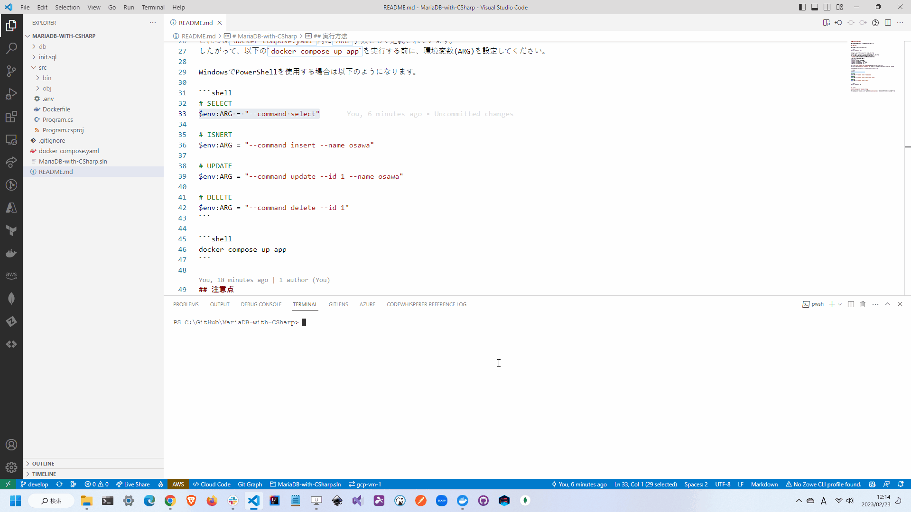

# MariaDB-with-CSharp

🦉🦉🦉 MariaDBをC#で操作するためのサンプルプログラム。  

  

## 実行方法

最初にデータベースを作成します。  

```shell
docker-compose up db -d
```

次にデータベース操作用のプログラムを実行します。  

このプログラムではデータベースに対してCRUD操作を行います。  
これらの操作はコマンドライン引数で指定します。  
`command`オプションの値によって操作を変更します。  

| コマンドライン引数 | 操作 |
| --- | --- |
| select | ユーザ一覧を取得 |
| insert | ユーザを追加 (name) |
| update | ユーザを更新 (id, name) |
| delete | ユーザを削除 (id) |

これらは`docker-compose.yaml`内に`ARG`引数として定義されています。  
したがって、以下の`docker compose up app`を実行する前に、環境変数(ARG)を設定してください。  

WindowsでPowerShellを使用する場合は以下のようになります。  

```shell
# SELECT
$env:ARG = "--command select"

# ISNERT
$env:ARG = "--command insert --name osawa"

# UPDATE
$env:ARG = "--command update --id 1 --name osawa"

# DELETE
$env:ARG = "--command delete --id 1"
```

```shell
docker compose up app
```

## 注意点

### MariaDBのバージョンは10.9以下で

MariaDBのバージョンが10.9よりも新しいと`connection.Open()`時にNULLキャストエラーが発生する。  
